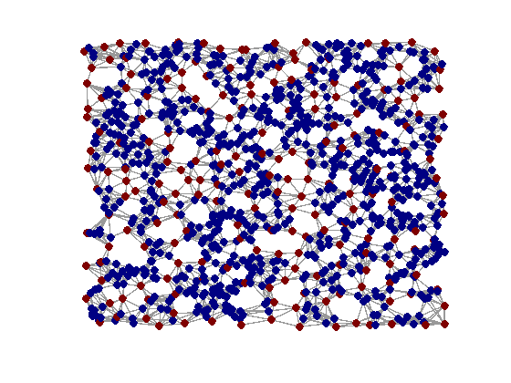
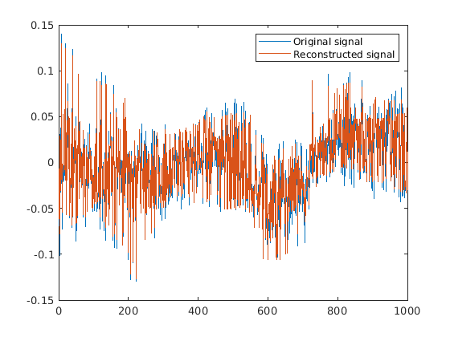

# Graph signal sampling

We measure values of a real valued smooth signal on the specific nodes of on a network using graph signal sampling.


Using these known values, we can predict the signal values on the remaining nodes of a network.


# How to sample graph signals

The software in this repository implements the *Approximate volume maximization* algorithm for graph signal sampling from [this paper](https://arxiv.org/abs/2102.10506).

## Download and Install


## Run the algorithm


## View results
If you're able to run the code succcessfully, you should be able to see results similar to these.

You should be able to see the sampled vertices highlighted in red.


You should be able to see the original and the reconstructed signal comparison in a single plot.


# Support this work

Your appreciation motivates me to do rigorous research and develop quality software. If you find this software useful, you can show your appreciation by starring the repository. If you use this software towards your research, cite [this paper](https://arxiv.org/abs/2102.10506). Here's the bibtex citation for your convenience.

```
@misc{jayawant2021practical,
      title={Practical graph signal sampling with log-linear size scaling},
      author={Ajinkya Jayawant and Antonio Ortega},
      year={2021},
      eprint={2102.10506},
      archivePrefix={arXiv},
      primaryClass={eess.SP}
}
```

I welcome technical feedback either through github issues or email to the [corresponding author](https://arxiv.org/pdf/2102.10506.pdf).